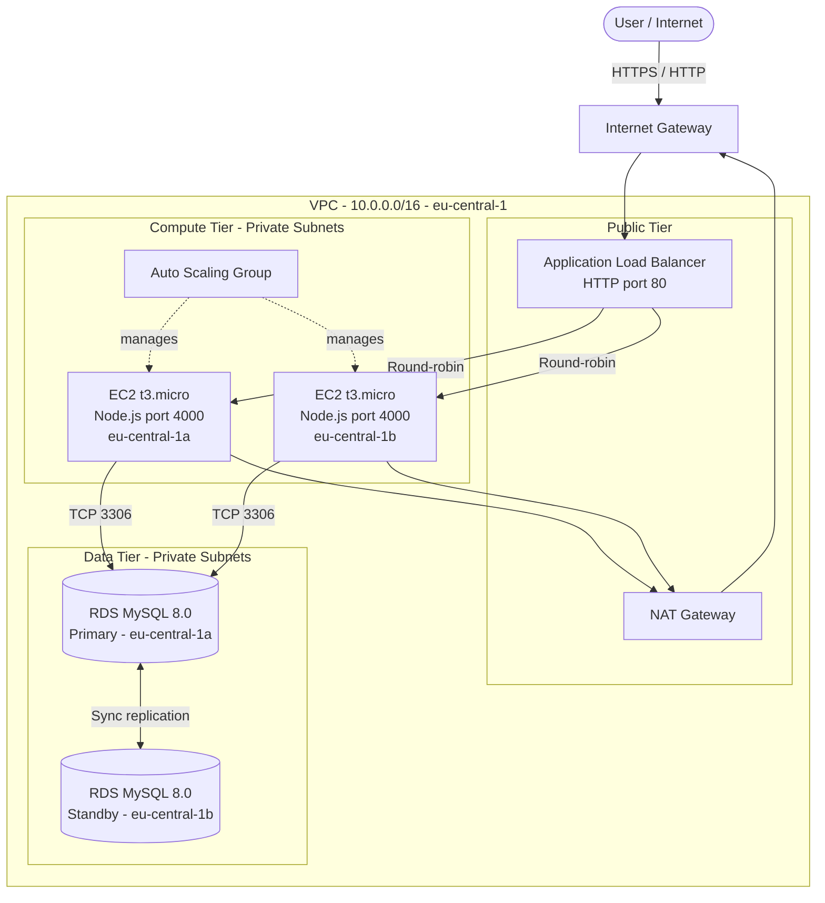
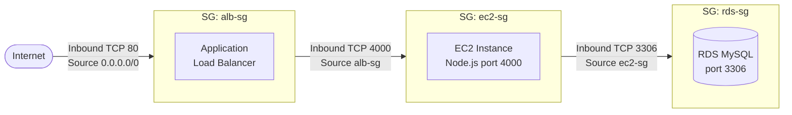
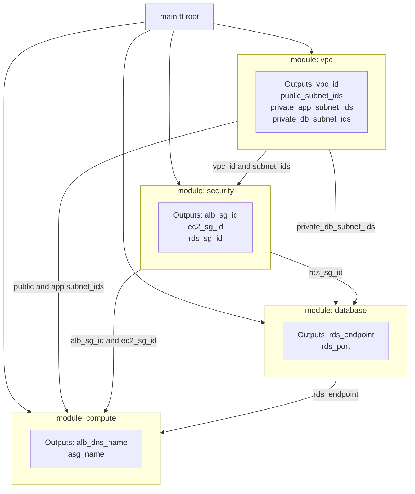

# Technical Architecture Design Document
## 3-Tier AWS Infrastructure — IaC vs Manual Provisioning

**Project:** Master Colloquium B
**Region:** `eu-central-1` (Frankfurt)
**Date:** July 7, 2026

---

## Table of Contents

1. [System Architecture Overview](#1-system-architecture-overview)
2. [VPC Network Topology](#2-vpc-network-topology)
3. [Security Architecture](#3-security-architecture)
4. [Application Layer — EC2 Bootstrap](#4-application-layer--ec2-bootstrap)
5. [Terraform Design](#5-terraform-design)
6. [Deployment Methodology Comparison](#6-deployment-methodology-comparison)
7. [Resource Specifications](#7-resource-specifications)
8. [Naming Conventions](#8-naming-conventions)

---

## 1. System Architecture Overview

The architecture follows a strict 3-tier separation: a **public network tier** (load balancer), a **private compute tier** (application servers), and a **private data tier** (database). Resources span two Availability Zones for fault tolerance.



> **Key design decisions:**
> - ALB placed in **both** public subnets — required for cross-AZ health checks
> - EC2 instances have **no public IP** — all outbound traffic routes through NAT GW
> - RDS standby is **passive** (Multi-AZ failover) — not a read replica, not directly accessible
> - NAT Gateway deployed in **Public Subnet A only** — single NAT GW is sufficient for this experiment scope; production would use one per AZ

---

## 2. VPC Network Topology

### 2.1 Subnet Layout

| Subnet | CIDR | AZ | Hosts |
|---|---|---|---|
| Public A | 10.0.1.0/24 | eu-central-1a | ALB node, NAT GW |
| Public B | 10.0.2.0/24 | eu-central-1b | ALB node |
| Private App A | 10.0.3.0/24 | eu-central-1a | EC2 (ASG) |
| Private App B | 10.0.4.0/24 | eu-central-1b | EC2 (ASG) |
| Private DB A | 10.0.5.0/24 | eu-central-1a | RDS primary |
| Private DB B | 10.0.6.0/24 | eu-central-1b | RDS standby |

### 2.2 Routing Tables

| Table | Associated Subnets | Routes |
|---|---|---|
| **Public RT** | Public A, Public B | `10.0.0.0/16 → local`, `0.0.0.0/0 → IGW` |
| **Private RT** | App A, App B, DB A, DB B | `10.0.0.0/16 → local`, `0.0.0.0/0 → NAT GW` |

> The DB subnets share the private route table. RDS requires no outbound internet access, but sharing the table simplifies the implementation. The security groups enforce the actual access boundary.

---

## 3. Security Architecture

### 3.1 Security Group Chain (Least-Privilege)

Traffic is permitted only along a strict one-directional chain. No security group allows unrestricted inbound access.



### 3.2 Security Group Rules (Detail)

**`alb-sg` — Application Load Balancer**

| Direction | Protocol | Port | Source / Destination | Purpose |
|---|---|---|---|---|
| Inbound | TCP | 80 | `0.0.0.0/0` | HTTP from internet |
| Outbound | All | All | `0.0.0.0/0` | ALB health checks to targets |

**`ec2-sg` — Application Servers**

| Direction | Protocol | Port | Source / Destination | Purpose |
|---|---|---|---|---|
| Inbound | TCP | 4000 | `alb-sg` (SG reference) | Traffic from ALB only |
| Outbound | TCP | 3306 | `rds-sg` (SG reference) | Database queries |
| Outbound | TCP | 80/443 | `0.0.0.0/0` | Package installs via NAT GW |

**`rds-sg` — Database**

| Direction | Protocol | Port | Source / Destination | Purpose |
|---|---|---|---|---|
| Inbound | TCP | 3306 | `ec2-sg` (SG reference) | MySQL from app servers only |
| Outbound | None | — | — | RDS requires no outbound rules |

> **Note:** SG-to-SG referencing (using the security group ID as the source, not a CIDR) is the critical detail that is most commonly missed in manual deployments — and is a primary source of the "configuration drift" metric.

---

## 4. Application Layer — EC2 Bootstrap

The EC2 launch template injects a Bash script that runs at first boot. Terraform passes the RDS endpoint, DB credentials, and the **app repository URL** as template variables. The application is a **minimal custom Node.js app** (`app/`) that reads its database settings from **environment variables** and uses the `mysql2` driver, so no config-file rewriting, schema seeding, or auth-plugin workaround is required. To avoid duplicated code, the instance **clones the app from the repository** (the single source of truth) rather than embedding it in the script.

### 4.1 User-Data Script (Reference)

> **Base image:** Ubuntu 22.04 LTS AMI (so the `apt-get` commands below apply). If an Amazon Linux 2023 AMI is used instead, replace `apt-get` with `dnf` and adjust the NodeSource setup accordingly.

```bash
#!/bin/bash
set -euo pipefail

# --- Variables injected by Terraform templatefile() ---
DB_HOST="${rds_endpoint}"          # RDS endpoint (host only, no :port)
DB_USER="${db_user}"               # e.g. admin
DB_PWD="${db_password}"            # from Terraform variable / secret
DB_NAME="${db_name}"               # default 'mysql'; SELECT NOW() needs no schema
APP_REPO="${app_repo_url}"         # public HTTPS repo URL (single source of truth)
APP_PORT="4000"
SRC_DIR="/opt/app-src"
APP_DIR="$SRC_DIR/app"

# --- OS update (minimal; skip full upgrade to keep boot time consistent) ---
apt-get update -y

# --- Install Node.js 18.x and git ---
curl -fsSL https://deb.nodesource.com/setup_18.x | bash -
apt-get install -y nodejs git

# --- Fetch the application from the repo (no duplicated inline code) ---
rm -rf "$SRC_DIR"
git clone --depth 1 "$APP_REPO" "$SRC_DIR"
npm install --prefix "$APP_DIR" --omit=dev

# --- Inject configuration via environment (systemd unit) ---
cat > /etc/systemd/system/demoapp.service <<EOF
[Unit]
Description=3-tier demo app
After=network.target

[Service]
WorkingDirectory=$APP_DIR
Environment=PORT=$APP_PORT
Environment=DB_HOST=$DB_HOST
Environment=DB_USER=$DB_USER
Environment=DB_PWD=$DB_PWD
Environment=DB_NAME=$DB_NAME
ExecStart=/usr/bin/node $APP_DIR/index.js
Restart=always
RestartSec=5

[Install]
WantedBy=multi-user.target
EOF

systemctl daemon-reload
systemctl enable --now demoapp

echo "Bootstrap complete. App cloned from $APP_REPO, started on :$APP_PORT"
```

> **Why this is robust:** the app lives in **one place** (the repo) and is cloned at boot — no duplicated inline copy to drift. The `mysql2` driver natively supports MySQL 8.0's `caching_sha2_password`, config is passed by environment variable (no file rewriting), and `SELECT NOW()` runs against the default `mysql` database — so **no schema seeding is needed**. Running under `systemd` also survives reboots and restarts on crash. The full `apt-get upgrade` is skipped to keep boot time consistent for the deployment-speed measurements.

---

## 5. Terraform Design

### 5.1 Module Dependency Graph

Data flows strictly downward — no circular dependencies.



### 5.2 File Structure

```
terraform/
├── main.tf              # Module calls, provider config
├── variables.tf         # Input variable declarations
├── outputs.tf           # Root-level outputs (ALB DNS, RDS endpoint)
├── terraform.tfvars     # Concrete values (region, instance type, etc.)
├── versions.tf          # required_providers with pinned versions
└── modules/
    ├── vpc/
    │   ├── main.tf      # VPC, subnets, IGW, NAT GW, EIP, route tables, associations
    │   ├── variables.tf
    │   └── outputs.tf
    ├── security/
    │   ├── main.tf      # alb-sg, ec2-sg, rds-sg with SG-to-SG rules
    │   ├── variables.tf
    │   └── outputs.tf
    ├── compute/
    │   ├── main.tf      # ALB, listener, target group, launch template, ASG
    │   ├── variables.tf
    │   ├── outputs.tf
    │   └── user_data.sh.tpl   # Bash template (rds_endpoint placeholder)
    └── database/
        ├── main.tf      # DB subnet group, RDS parameter group, RDS instance
        ├── variables.tf
        └── outputs.tf
```

### 5.3 Key Variables (`terraform.tfvars`)

```hcl
aws_region          = "eu-central-1"
vpc_cidr            = "10.0.0.0/16"
az_a                = "eu-central-1a"
az_b                = "eu-central-1b"
instance_type       = "t3.micro"
db_instance_class   = "db.t3.micro"
db_engine_version   = "8.0"
db_multi_az         = true
min_size            = 1
max_size            = 2
desired_capacity    = 2
name_prefix         = "tf"           # → all resources get "tf-" prefix
```

---

## 6. Deployment Methodology Comparison

### 6.1 Manual (Click-Ops) Deployment Steps

Stopwatch starts at step 1, stops when `curl` on the ALB DNS returns HTTP 200. Each fix required (misconfigured SG, wrong port, user-data typo) increments the error counter for the drift metric.

1. Create VPC (`manual-vpc`, CIDR `10.1.0.0/16`)
2. Create 6 subnets (2 public, 2 app-private, 2 db-private)
3. Create Internet Gateway; attach to VPC
4. Allocate Elastic IP; create NAT Gateway in Public Subnet A
5. Create + configure route tables (public → IGW, private → NAT GW); associate all subnets
6. Create 3 security groups (`alb-sg`, `ec2-sg`, `rds-sg`) with SG-to-SG rules
7. Create ALB + listener :80 + target group
8. Create launch template (t3.micro, `ec2-sg`, user-data pasted manually)
9. Create Auto Scaling Group (min 1 / max 2 / desired 2); attach target group
10. Create DB subnet group (both DB subnets)
11. Create RDS instance (MySQL 8.0, Multi-AZ) — ~10–15 min provisioning wait
12. Verify ALB DNS → HTTP 200; record time + screenshot

### 6.2 Terraform Deployment Steps

1. `terraform init` — provider download, backend init
2. `time terraform apply -auto-approve` — Terraform builds the dependency graph and provisions in order: networking → security → (database + compute in parallel) → ASG
3. Record wall-clock time from the apply output
4. Verify ALB DNS → HTTP 200
5. `terraform plan` again → expect **"No changes"** (drift verification)

---

## 7. Resource Specifications

### AWS Resources Provisioned (Both Environments)

| Resource | Type / Config | Count | Naming (tf / manual) |
|---|---|---|---|
| VPC | `10.0.0.0/16` (tf) / `10.1.0.0/16` (manual) | 1 each | `tf-vpc` / `manual-vpc` |
| Public Subnets | `/24` per AZ | 2 each | `tf-public-a/b` / `manual-public-a/b` |
| Private App Subnets | `/24` per AZ | 2 each | `tf-app-a/b` / `manual-app-a/b` |
| Private DB Subnets | `/24` per AZ | 2 each | `tf-db-a/b` / `manual-db-a/b` |
| Internet Gateway | — | 1 each | `tf-igw` / `manual-igw` |
| NAT Gateway | Single, in Public A | 1 each | `tf-natgw` / `manual-natgw` |
| Elastic IP | For NAT GW | 1 each | `tf-eip` / `manual-eip` |
| Route Tables | Public + Private | 2 each | `tf-rt-pub/priv` / `manual-rt-pub/priv` |
| Security Groups | ALB + EC2 + RDS | 3 each | `tf-alb/ec2/rds-sg` / `manual-alb/ec2/rds-sg` |
| Application Load Balancer | Internet-facing | 1 each | `tf-alb` / `manual-alb` |
| ALB Listener | HTTP :80 | 1 each | — |
| Target Group | HTTP :4000 (health path /health) | 1 each | `tf-tg` / `manual-tg` |
| Launch Template | `t3.micro`, Ubuntu 22.04 LTS | 1 each | `tf-lt` / `manual-lt` |
| Auto Scaling Group | Min:1 Max:2 Desired:2 | 1 each | `tf-asg` / `manual-asg` |
| EC2 Instances | `t3.micro` | 2 each (via ASG) | managed by ASG |
| DB Subnet Group | Covers both DB subnets | 1 each | `tf-db-subnet-group` / `manual-db-subnet-group` |
| RDS Instance | MySQL 8.0, `db.t3.micro`, Multi-AZ | 1 each | `tf-rds` / `manual-rds` |

**Total resources per environment: ~28**
**Total AWS resources across both runs: ~56**

> Both VPCs use different CIDR blocks (`10.0.x.x` for Terraform, `10.1.x.x` for manual) to ensure complete isolation and avoid routing conflicts.

---

## 8. Naming Conventions

All resources follow a strict prefix convention to keep the two environments isolated.

| Prefix | Environment | Purpose |
|---|---|---|
| `tf-` | Terraform | All resources provisioned by `terraform apply` |
| `manual-` | Manual | All resources created via AWS Management Console |

Pattern: `{prefix}-{component}-{detail}` (e.g. `tf-alb-sg`, `manual-public-a`). This ensures no cross-environment dependencies, clear identification in billing, and clean independent teardown.
